<div align="center">

# 💰 Personal Finance & Expense Intelligence Dashboard

### Transforming Financial Data into Actionable Insights

*A Full-Stack Python Application for Intelligent Expense Tracking, Analytics & Machine Learning Predictions.*

---


---

**Engineering Project • Data Analytics • Machine Learning • Software Engineering • Visualization**

</div>

---

# 📖 Table of Contents

- About
- Why this Project
- Features
- System Overview
- Five Layer Architecture
- System Flow
- Request Lifecycle
- Data Flow
- Architecture Philosophy

---

# 🚀 About

The **Personal Finance & Expense Intelligence Dashboard** is a production-inspired full-stack Python application that helps users monitor, analyze, and predict their financial spending.

Unlike traditional expense trackers that simply store transactions, this platform combines:

- Intelligent analytics
- Statistical analysis
- Interactive dashboards
- Machine Learning predictions
- Budget monitoring
- Spending anomaly detection

to convert raw financial records into meaningful insights.

The application demonstrates modern software engineering principles while solving a real-world financial management problem.

---

# 🎯 Why this Project?

Managing personal finances is often reduced to manually recording expenses without understanding spending behavior.

This project bridges that gap by combining:

✔ Expense Management

✔ Budget Tracking

✔ Financial Analytics

✔ Interactive Data Visualization

✔ Machine Learning

✔ Modular Software Engineering

into a single intelligent platform.

---

# ✨ Core Features

## 📊 Expense Management

- Add Daily Expenses
- Edit Existing Records
- Delete Transactions
- Categorize Expenses
- Budget Management

---

## 📈 Financial Analytics

- Monthly Reports
- Category-wise Spending
- Spending Trends
- Income vs Expense Analysis
- Average Monthly Expenses
- Expense Heatmaps

---

## 🤖 Machine Learning

- Predict Next Month Expenses
- Spending Forecast
- Budget Overspending Prediction
- Expense Trend Learning
- Anomaly Detection

---

## 📉 Data Visualization

- Pie Charts
- Monthly Bar Charts
- Trend Lines
- Category Comparison
- Heat Maps

---

## ⚙ Engineering Features

- Object-Oriented Design
- SQLite Database
- REST APIs
- Streamlit Dashboard
- Flask Backend
- Logging
- Exception Handling
- CSV Export
- Multithreading
- Modular Architecture

---

# 🏗 Five Layer Architecture

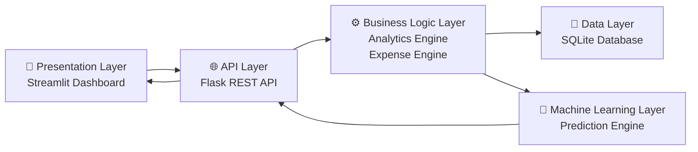

---

# 🌍 High Level System Architecture

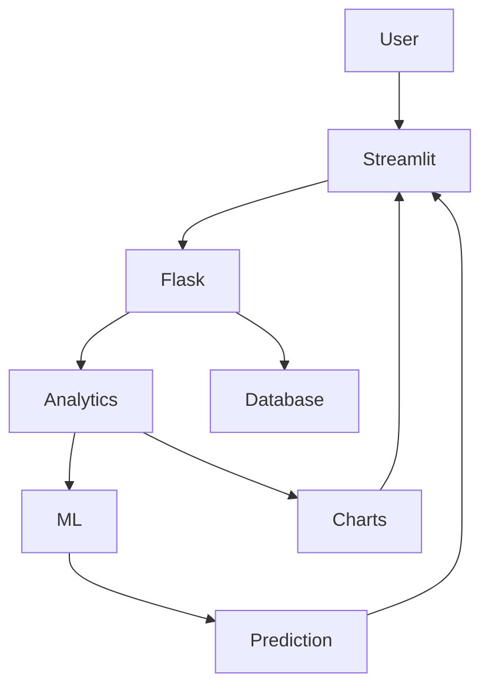

---

# 🔄 Complete Request Lifecycle

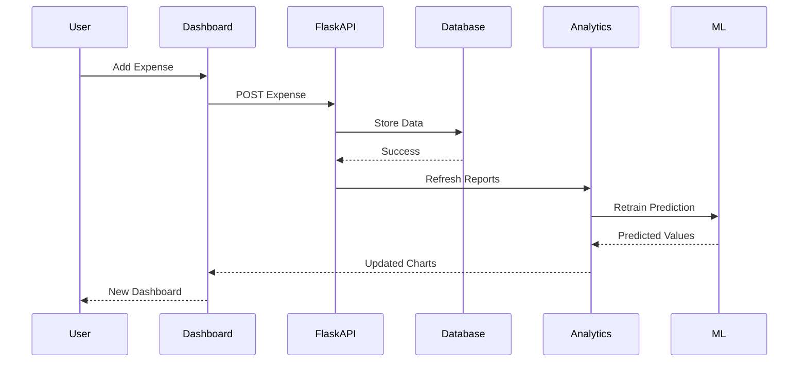

---

# 📊 Expense Processing Flow

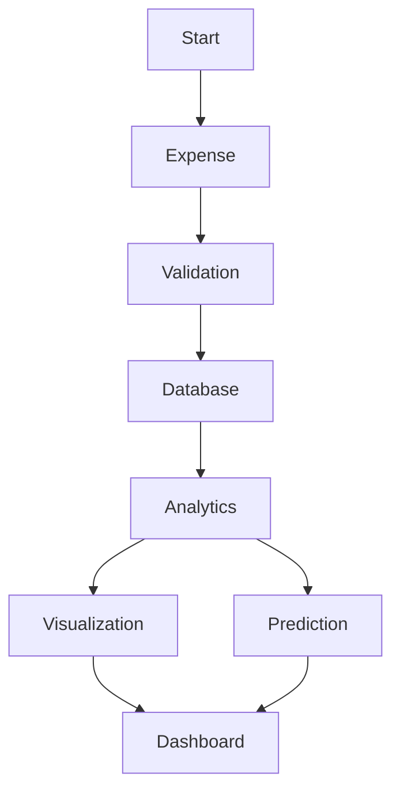

---

# 🧠 Machine Learning Pipeline

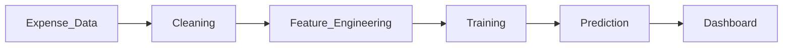

---

# 📂 Internal Module Communication

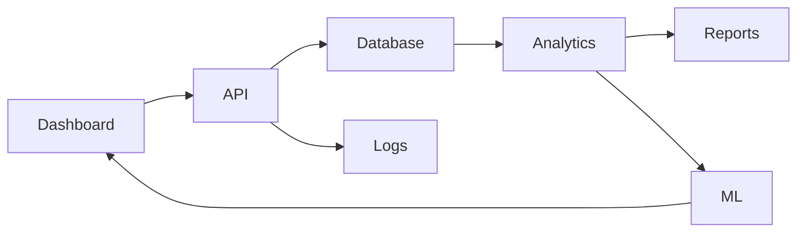

---

# 🎯 Architecture Philosophy

The project follows a **layered architecture**, ensuring each component has a clearly defined responsibility.

```
Presentation Layer
        │
        ▼
API Layer
        │
        ▼
Business Logic
        │
        ▼
Database Layer
        │
        ▼
Machine Learning Layer
```

Each layer communicates only through well-defined interfaces, improving maintainability, scalability, and testability.

---

# ⭐ Highlights

- Modular Python Architecture
- Production Inspired Design
- REST API Driven Backend
- Interactive Dashboard
- Predictive Analytics
- Financial Intelligence
- Machine Learning Integration
- Extensible Codebase
- Engineering Best Practices
- Resume-Ready Full Stack Project

# 🚀 How It Works

1. User opens the Streamlit dashboard.
2. Adds a new expense.
3. Flask validates the request.
4. SQLite stores the transaction.
5. Analytics Engine updates summaries.
6. Charts refresh automatically.
7. Machine Learning predicts future spending.
8. Dashboard displays insights in real time.

---

> **"Track smarter. Analyze deeper. Predict the future of your finances."**

---

# 🛠 Technology Stack

The application is built using a modern Python ecosystem following a modular layered architecture.

---

## 💻 Programming Language

| Technology | Purpose |
|------------|----------|
| Python 3.11+ | Core Development Language |

---

## 🌐 Backend

| Technology | Purpose |
|------------|----------|
| Flask | REST API Backend |
| RESTful APIs | Communication between Dashboard & Backend |
| Threading | Background Report Generation |
| Logging | Activity Tracking |
| Exception Handling | Error Management |

---

## 🎨 Frontend

| Technology | Purpose |
|------------|----------|
| Streamlit | Interactive Dashboard |
| Streamlit Pages | Multi-page Application |
| Streamlit Sidebar | Navigation |
| Metric Cards | Dashboard Overview |

---

## 💾 Database

| Technology | Purpose |
|------------|----------|
| SQLite | Lightweight Relational Database |
| SQL | CRUD Operations |
| schema.sql | Database Schema |

---

## 📊 Data Analytics

| Library | Purpose |
|----------|----------|
| Pandas | Data Cleaning & Analysis |
| NumPy | Numerical Computation |
| Matplotlib | Graph Generation |
| Seaborn | Statistical Visualization |

---

## 🤖 Machine Learning

| Library | Purpose |
|----------|----------|
| Scikit-Learn | Machine Learning Models |
| Linear Regression | Expense Prediction |
| NumPy | Feature Engineering |
| Pandas | Dataset Preparation |

---

## ⚙ Software Engineering Concepts

- Object-Oriented Programming
- Modular Architecture
- File Handling
- Logging
- Exception Handling
- Generators
- Iterators
- Decorators
- Memory Optimization
- Multithreading
- REST APIs

---

# 🏗 Complete Project Structure

```text
finance-dashboard/
│
├── analytics/
│   ├── __init__.py
│   ├── reports.py
│   ├── charts.py
│   ├── stats.py
│   └── insights.py
│
├── api/
│   ├── __init__.py
│   ├── app.py
│   ├── routes.py
│   ├── background.py
│   ├── middleware.py
│   └── utils.py
│
├── core/
│   ├── __init__.py
│   ├── decorators.py
│   ├── expense_engine.py
│   ├── exceptions.py
│   ├── file_handler.py
│   ├── validator.py
│   └── logger.py
│
├── dashboard/
│   ├── streamlit_app.py
│   │
│   ├── assets/
│   │   ├── logo.png
│   │   ├── banner.png
│   │   └── icons/
│   │
│   ├── pages/
│   │   ├── 1_Overview.py
│   │   ├── 2_Expenses.py
│   │   ├── 3_Analytics.py
│   │   ├── 4_Predictions.py
│   │   └── 5_Settings.py
│   │
│   └── components/
│       ├── cards.py
│       ├── sidebar.py
│       └── charts.py
│
├── database/
│   ├── finance.db
│   ├── db_manager.py
│   ├── models.py
│   ├── schema.sql
│   └── seed_data.py
│
├── exports/
│   ├── csv/
│   ├── reports/
│   └── pdf/
│
├── logs/
│   ├── application.log
│   └── errors.log
│
├── ml/
│   ├── predictor.py
│   ├── anomaly.py
│   ├── preprocessing.py
│   ├── train.py
│   ├── model.pkl
│   └── scaler.pkl
│
├── tests/
│   ├── test_database.py
│   ├── test_api.py
│   ├── test_ml.py
│   ├── test_analytics.py
│   └── test_dashboard.py
│
├── screenshots/
│   ├── dashboard.png
│   ├── analytics.png
│   ├── prediction.png
│   └── expenses.png
│
├── .env
├── .gitignore
├── config.py
├── requirements.txt
├── LICENSE
└── README.md
```

---

# 📦 Clone Repository

```bash
git clone https://github.com/Skit-025/Quick-Manage.git
```

Move into the project directory

```bash
cd Quick-Manage
```

---

# 🐍 Create Virtual Environment

### Windows

```bash
python -m venv venv
```

Activate

```bash
venv\Scripts\activate
```

---

### Linux / macOS

```bash
python3 -m venv venv

source venv/bin/activate
```

---

# 📥 Install Dependencies

```bash
pip install -r requirements.txt
```

---

# 📄 requirements.txt

```txt
Flask
streamlit
pandas
numpy
matplotlib
seaborn
scikit-learn
sqlite3
python-dotenv
requests
pytest
```

---

# ⚙ Configure Environment

Create a `.env` file inside the project root.

```env
SECRET_KEY=your_secret_key

DATABASE_URL=database/finance.db

DEBUG=True
```

---

# 🚀 Running the Backend

```bash
cd api

python app.py
```

Flask will start on

```
http://127.0.0.1:5000
```

---

# 🎨 Running the Dashboard

```bash
streamlit run dashboard/streamlit_app.py
```

Dashboard opens automatically at

```
http://localhost:8501
```

---

# 📡 API Endpoints

## Expense APIs

| Method | Endpoint | Description |
|---------|----------|-------------|
| GET | /expenses | Fetch Expenses |
| POST | /expenses | Add Expense |
| PUT | /expenses/<id> | Update Expense |
| DELETE | /expenses/<id> | Delete Expense |

---

## Analytics APIs

| Method | Endpoint |
|---------|----------|
| GET | /summary |
| GET | /monthly |
| GET | /categories |
| GET | /charts |

---

## Prediction APIs

| Method | Endpoint |
|---------|----------|
| GET | /predict |
| GET | /forecast |
| GET | /anomaly |

---

# 🗄 Database Schema

```text
Users
│
├── user_id
├── name
├── email
└── created_at

Expenses
│
├── expense_id
├── user_id
├── category
├── amount
├── date
└── remarks

Budgets
│
├── budget_id
├── category
├── amount
└── month

Predictions
│
├── prediction_id
├── category
├── predicted_amount
└── confidence
```

---

# 🔄 Project Execution Flow

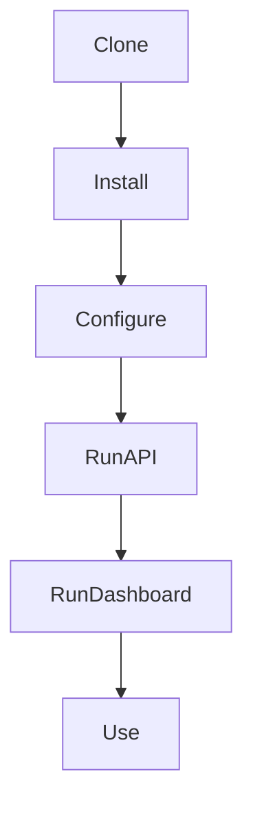

---

# 📂 Module Dependency

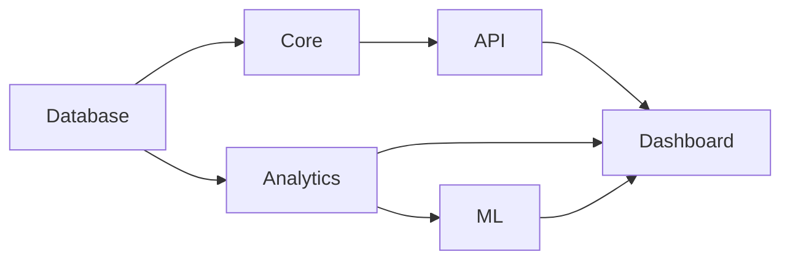

---

# 🔒 Security Practices

- Environment Variables
- Exception Handling
- Input Validation
- Request Validation
- Error Logging
- Secure Database Access
- Parameterized SQL Queries
- Modular Architecture

---

# ⚡ Performance Optimizations

- Lazy Loading
- Generators for Memory Efficiency
- Background Threads
- Vectorized NumPy Operations
- Efficient Pandas Aggregations
- Modular Imports
- Optimized SQL Queries

---

# 📈 Project Statistics

| Category | Count |
|-----------|------:|
| Modules | 5 |
| Python Packages | 10+ |
| Dashboard Pages | 5 |
| Database Tables | 4 |
| REST APIs | 10+ |
| ML Models | 2 |
| Visualizations | 6+ |
| Reports | CSV + PDF |

---
# 🤖 Machine Learning Pipeline

The dashboard incorporates Machine Learning to move beyond static expense tracking by forecasting future spending patterns and identifying abnormal transactions.

The prediction engine continuously learns from historical expense data and provides personalized financial insights.

---

## 🧠 Machine Learning Workflow

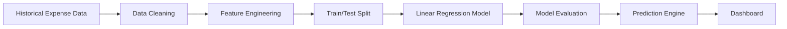

---

# 📊 Data Analytics Pipeline

Every expense entered into the application passes through multiple analytical stages before becoming a visualization.

flowchart TD

Expense Entry

Database

Pandas Processing

NumPy Statistics

Visualization

Dashboard

Expense Entry --> Database

Database --> Pandas Processing

Pandas Processing --> NumPy Statistics

NumPy Statistics --> Visualization

Visualization --> Dashboard
```

---

# 📈 Analytics Engine

The analytics module transforms raw financial records into meaningful business insights.

## Monthly Analytics

- Total Expenses
- Total Savings
- Budget Utilization
- Spending Growth
- Monthly Comparison

---

## Category Analytics

- Food Expenses
- Transport Expenses
- Shopping
- Bills
- Entertainment
- Medical
- Education
- Miscellaneous

---

## Statistical Analytics

- Mean Spending
- Median Spending
- Standard Deviation
- Expense Distribution
- Spending Trend
- Peak Expense Day
- Monthly Average

---

# 📉 Prediction Engine

The ML layer predicts

- Next Month Expense
- Category-wise Spending
- Budget Overflow
- Spending Growth
- Financial Trend

---

# 🚨 Anomaly Detection

The anomaly detection engine flags transactions that significantly deviate from a user's historical spending behavior.

Examples include:

- Unusually high restaurant bills
- Unexpected shopping spikes
- Duplicate transactions
- Extreme one-time expenses
- Sudden monthly increase

---

# 🔬 Machine Learning Model

| Component | Implementation |
|-----------|----------------|
| Algorithm | Linear Regression |
| Library | Scikit-Learn |
| Dataset | Historical User Expenses |
| Target | Future Expense |
| Features | Date, Category, Monthly Spend |
| Output | Predicted Spending |

---

# 📊 Feature Engineering

The model extracts meaningful features such as

```
Expense Amount

↓

Category Encoding

↓

Monthly Aggregation

↓

Average Spending

↓

Trend Calculation

↓

Training Dataset
```

---

# 📈 Dashboard Overview

The application consists of multiple interactive pages.

## 🏠 Overview

- Financial Summary
- Budget Left
- Monthly Spending
- Savings
- Expense Cards

---

## 💵 Expenses

- Add Expense
- Edit Expense
- Delete Expense
- Filter Records
- Search Transactions

---

## 📊 Analytics

- Pie Chart
- Bar Chart
- Monthly Trend
- Category Comparison
- Heatmap

---

## 🤖 Predictions

- Future Expense
- Overspending Alert
- Forecast Chart
- Budget Prediction
- Expense Trend

---

## ⚙ Settings

- Export CSV
- Generate Reports
- Theme Settings
- User Preferences

---

# 📸 Dashboard Preview

> Replace these placeholders with your screenshots after deployment.

```
screenshots/

│

├── overview.png

├── expenses.png

├── prediction.png

├── analytics.png
```

---

## 🏠 Overview Page

```markdown
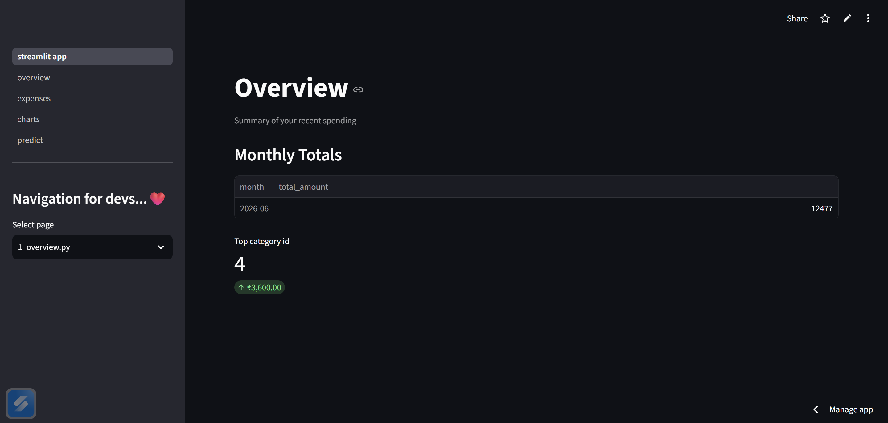
```

---

## 💰 Expenses Page

```markdown
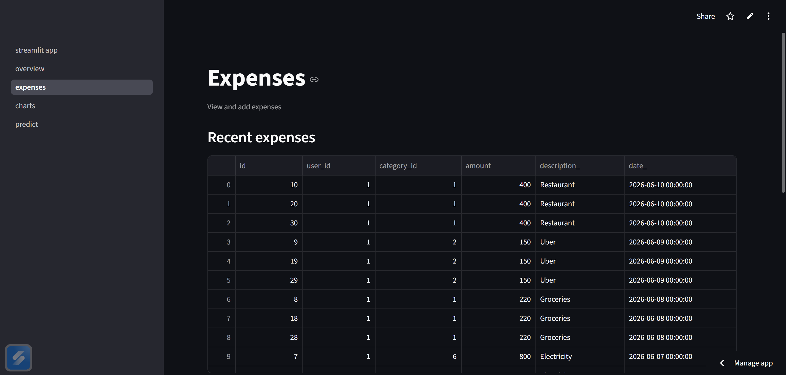
```

---

## 📈 Analytics Dashboard

```markdown

```

---

## 🤖 Prediction Dashboard

```markdown
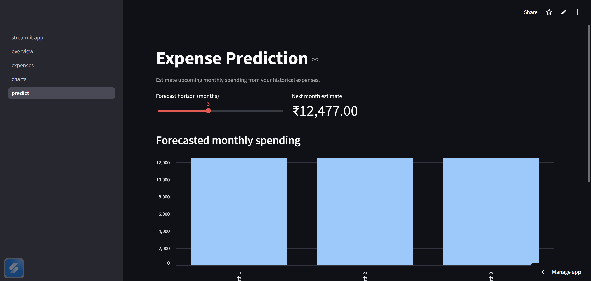
```

---

# 📊 Data Flow Diagram

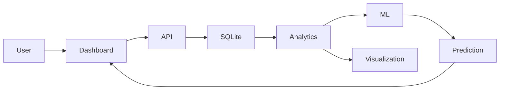

---

# 🔄 Expense Lifecycle

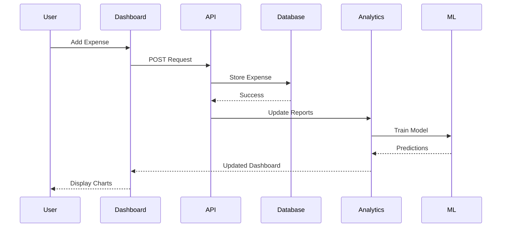

---

# ⚡ Request Processing Pipeline

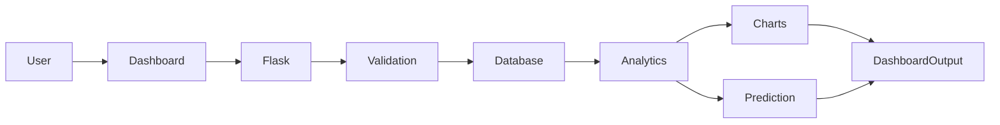

---

# 📊 Supported Visualizations

| Visualization | Purpose |
|---------------|---------|
| Bar Chart | Monthly Comparison |
| Pie Chart | Category Distribution |
| Line Chart | Spending Trend |
| Heatmap | Daily Spending Pattern |
| Histogram | Expense Frequency |
| Scatter Plot | Expense Correlation |

---

# 📈 Performance Goals

| Metric | Target |
|---------|-------:|
| Dashboard Load Time | <2 sec |
| API Response Time | <100 ms |
| Database Query | <50 ms |
| ML Prediction | <300 ms |
| CSV Export | <2 sec |
| Report Generation | <5 sec |

---

# 🚀 Deployment Architecture

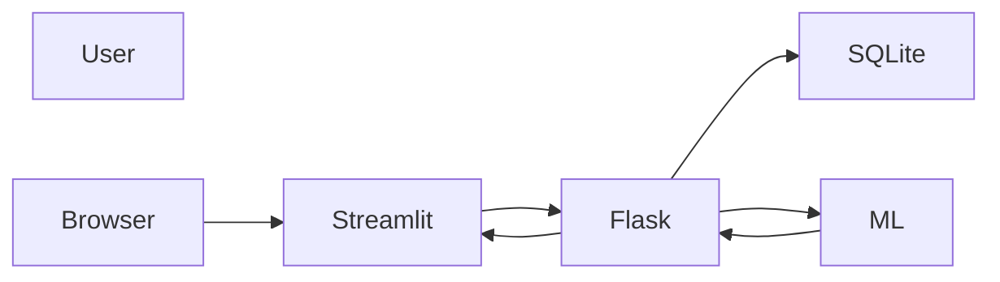

---

# 🏆 Key Highlights

- 📊 Interactive Financial Dashboard
- 📈 Advanced Data Analytics
- 🤖 Machine Learning Predictions
- 🚨 Expense Anomaly Detection
- 🌐 REST API Architecture
- 🗄 Relational Database Design
- 📉 Rich Data Visualization
- ⚡ Optimized Performance
- 🧩 Modular Python Architecture
- 🔒 Secure & Maintainable Codebase

---

# 📌 Resume Impact

This project demonstrates proficiency in:

- Python Development
- Software Engineering
- Data Analytics
- Machine Learning
- REST API Development
- Database Design
- Streamlit
- Flask
- Object-Oriented Programming
- Production-Level Project Architecture

---

> **"From recording expenses to predicting financial behavior — this project showcases the complete lifecycle of data-driven application development."**

# 🛣 Project Roadmap

The roadmap outlines the planned evolution of the Personal Finance & Expense Intelligence Dashboard.

---

## ✅ Version 1.0 (Completed)

- Expense Management
- Category Management
- SQLite Database
- Interactive Dashboard
- Flask REST API
- Streamlit UI
- Monthly Analytics
- CSV Export
- Budget Tracking
- Linear Regression Prediction
- Anomaly Detection
- Logging
- Exception Handling
- Modular Architecture

---

## 🚀 Version 2.0

- User Authentication
- Secure Password Hashing
- Multi-user Support
- Profile Management
- Email Notifications
- Budget Alerts
- Monthly PDF Reports
- Income Tracking
- Savings Goals

---

## 🌍 Version 3.0

- PostgreSQL Support
- Docker Deployment
- JWT Authentication
- Cloud Deployment
- Redis Caching
- Background Workers
- Scheduled Reports
- Email Reports

---

## 🤖 Version 4.0

- Deep Learning Models
- LSTM Expense Forecasting
- AI Financial Assistant
- Smart Budget Recommendation
- Personalized Insights
- AI Chat Interface

---

## 📱 Version 5.0

- Android Application
- iOS Application
- Push Notifications
- OCR Receipt Scanner
- Voice Expense Logging
- QR Bill Scanner
- Offline Synchronization

---

# 🎯 Future Enhancements

The project has been intentionally designed with extensibility in mind.

Future improvements include:

- Dark & Light Theme
- Multi-language Support
- Expense Sharing
- Family Budget
- Bank Account Integration
- UPI Integration
- Credit Card Analysis
- Investment Tracker
- SIP Planner
- Tax Calculator
- GST Tracking
- Expense Recommendations
- AI Insights
- Cloud Synchronization
- Docker Containerization
- CI/CD Pipeline
- Kubernetes Deployment

---

# 🧪 Testing Strategy

The application follows a modular testing approach.

## Unit Testing

- Database Layer
- Business Logic
- Analytics Module
- Machine Learning
- API Endpoints

---

## Integration Testing

- Flask ↔ SQLite
- Dashboard ↔ API
- Analytics ↔ Database
- ML ↔ Analytics

---

## Functional Testing

- Add Expense
- Edit Expense
- Delete Expense
- Export CSV
- Generate Reports
- Predict Expenses

---

## Performance Testing

- API Response Time
- Dashboard Loading
- Query Optimization
- Large Dataset Processing

---

# 📂 Branch Strategy

```
main
│
├── development
│
├── feature/dashboard
│
├── feature/api
│
├── feature/database
│
├── feature/ml
│
└── hotfix
```

---

# 🤝 Contributing

Contributions are always welcome.

If you would like to contribute:

1. Fork the repository

2. Create a new branch

```bash
git checkout -b feature/new-feature
```

3. Commit your changes

```bash
git commit -m "Added New Feature"
```

4. Push your branch

```bash
git push origin feature/new-feature
```

5. Open a Pull Request

---

# 📋 Contribution Guidelines

Please ensure that:

- Code follows PEP-8
- Every new feature includes documentation
- Functions contain docstrings
- No sensitive information is committed
- All tests pass before creating a PR

---

# 📝 Commit Message Convention

```
feat: Added prediction model

fix: Fixed dashboard bug

docs: Updated README

style: Code formatting

refactor: Improved analytics engine

test: Added API tests

chore: Updated dependencies
```

---

# 🔒 Security

This project follows secure development practices.

- Environment Variables
- Parameterized SQL Queries
- Input Validation
- Exception Handling
- Activity Logging
- Secure API Communication
- Modular Design

---

# 📊 Project Metrics

| Metric | Value |
|---------|-------|
| Architecture | 5-Layer |
| Backend | Flask |
| Frontend | Streamlit |
| Database | SQLite |
| Machine Learning | Scikit-Learn |
| Programming Language | Python |
| Charts | Matplotlib + Seaborn |
| Analytics Engine | Pandas + NumPy |

---

# 📈 Repository Statistics

```
Language

Python        ████████████████████ 95%

SQL           ██ 3%

Markdown      █ 2%
```

---

# ⭐ If You Like This Project

If you found this project useful,

please consider

⭐ Star the Repository

🍴 Fork the Repository

🐛 Report Bugs

💡 Suggest New Features

---

# 📚 Learning Outcomes

This project demonstrates practical understanding of:

- Python Programming
- Object-Oriented Programming
- REST API Development
- Flask
- Streamlit
- SQLite
- SQL
- Pandas
- NumPy
- Matplotlib
- Seaborn
- Scikit-Learn
- Machine Learning
- Software Engineering
- Exception Handling
- Logging
- Generators
- Decorators
- Multithreading
- Production Architecture

---

# 🙏 Acknowledgements

Special thanks to the open-source community and the creators of the amazing technologies that made this project possible.

- Python Community
- Flask
- Streamlit
- Pandas
- NumPy
- Matplotlib
- Seaborn
- Scikit-Learn
- SQLite

---

# 📄 License

This project is licensed under the **MIT License**.

See the [LICENSE](LICENSE) file for complete details.

---

# 👨‍💻 Author

<div align="center">

## Aditya Prasad Barik

**Computer Science Engineering Student**

Building practical software solutions through Python, Data Analytics, and Machine Learning.

---

### Connect With Me

<p align="center">

<a href="https://github.com/Skit-025">

</a>

<a href="https://www.linkedin.com/">

</a>

<a href="mailto:codesheritahge@gmail.com">

</a>

</p>

</div>

---

# 🌟 Support the Project

If this repository helped you learn something new or inspired your own work, consider giving it a ⭐ on GitHub.

Your support helps improve the project and motivates future development.

---

<div align="center">

## 💰 Personal Finance & Expense Intelligence Dashboard

### *Track Smarter • Analyze Better • Predict the Future*

---

**Built with ❤️ using Python, Flask, Streamlit, SQLite, Pandas, NumPy, and Scikit-Learn**

---

⭐ **Star this repository if you found it useful!**

</div>