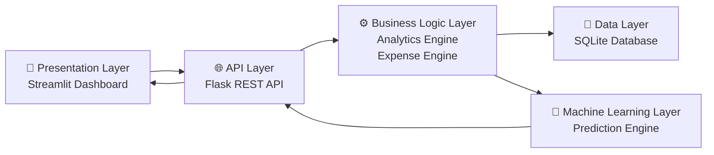
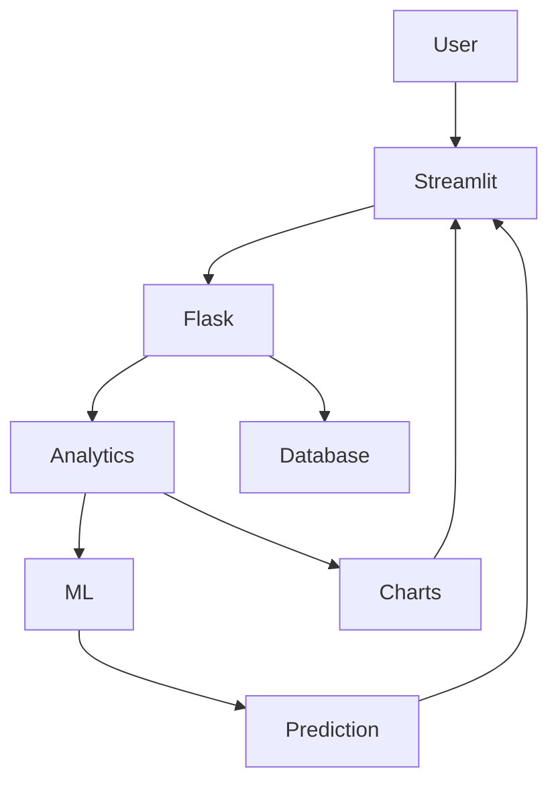
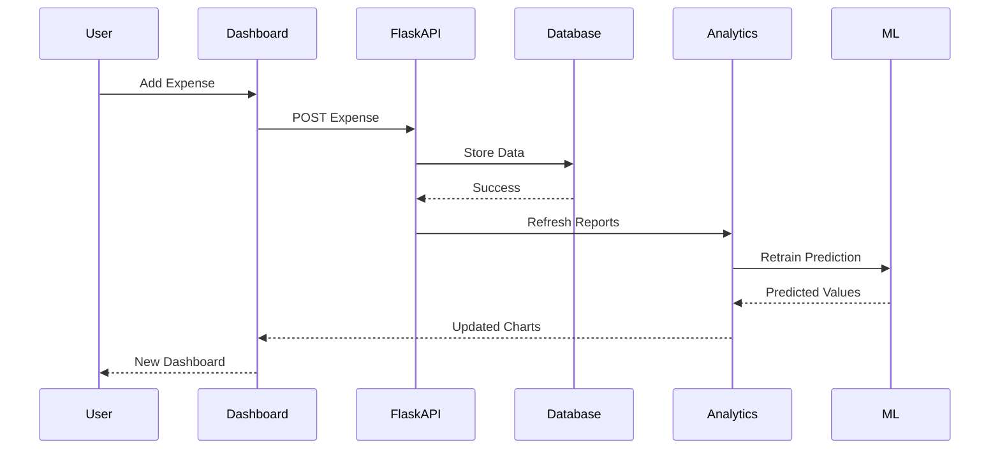
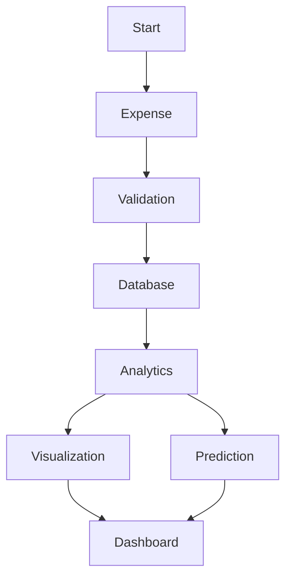
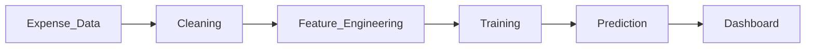
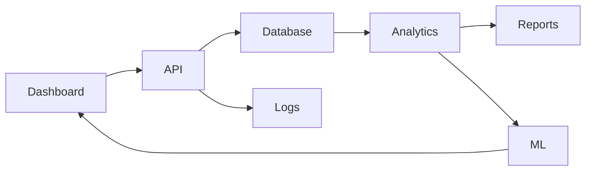

<div align="center">

# 💰 Personal Finance & Expense Intelligence Dashboard

### Transforming Financial Data into Actionable Insights

*A Full-Stack Python Application for Intelligent Expense Tracking, Analytics & Machine Learning Predictions.*

---


---

**Engineering Project • Data Analytics • Machine Learning • Software Engineering • Visualization**

</div>

---

# 📖 Table of Contents

- About
- Why this Project
- Features
- System Overview
- Five Layer Architecture
- System Flow
- Request Lifecycle
- Data Flow
- Architecture Philosophy

---

# 🚀 About

The **Personal Finance & Expense Intelligence Dashboard** is a production-inspired full-stack Python application that helps users monitor, analyze, and predict their financial spending.

Unlike traditional expense trackers that simply store transactions, this platform combines:

- Intelligent analytics
- Statistical analysis
- Interactive dashboards
- Machine Learning predictions
- Budget monitoring
- Spending anomaly detection

to convert raw financial records into meaningful insights.

The application demonstrates modern software engineering principles while solving a real-world financial management problem.

---

# 🎯 Why this Project?

Managing personal finances is often reduced to manually recording expenses without understanding spending behavior.

This project bridges that gap by combining:

✔ Expense Management

✔ Budget Tracking

✔ Financial Analytics

✔ Interactive Data Visualization

✔ Machine Learning

✔ Modular Software Engineering

into a single intelligent platform.

---

# ✨ Core Features

## 📊 Expense Management

- Add Daily Expenses
- Edit Existing Records
- Delete Transactions
- Categorize Expenses
- Budget Management

---

## 📈 Financial Analytics

- Monthly Reports
- Category-wise Spending
- Spending Trends
- Income vs Expense Analysis
- Average Monthly Expenses
- Expense Heatmaps

---

## 🤖 Machine Learning

- Predict Next Month Expenses
- Spending Forecast
- Budget Overspending Prediction
- Expense Trend Learning
- Anomaly Detection

---

## 📉 Data Visualization

- Pie Charts
- Monthly Bar Charts
- Trend Lines
- Category Comparison
- Heat Maps

---

## ⚙ Engineering Features

- Object-Oriented Design
- SQLite Database
- REST APIs
- Streamlit Dashboard
- Flask Backend
- Logging
- Exception Handling
- CSV Export
- Multithreading
- Modular Architecture

---

# 🏗 Five Layer Architecture



---

# 🌍 High Level System Architecture



---

# 🔄 Complete Request Lifecycle



---

# 📊 Expense Processing Flow



---

# 🧠 Machine Learning Pipeline



---

# 📂 Internal Module Communication



---

# 🎯 Architecture Philosophy

The project follows a **layered architecture**, ensuring each component has a clearly defined responsibility.

```
Presentation Layer
        │
        ▼
API Layer
        │
        ▼
Business Logic
        │
        ▼
Database Layer
        │
        ▼
Machine Learning Layer
```

Each layer communicates only through well-defined interfaces, improving maintainability, scalability, and testability.

---

# ⭐ Highlights

- Modular Python Architecture
- Production Inspired Design
- REST API Driven Backend
- Interactive Dashboard
- Predictive Analytics
- Financial Intelligence
- Machine Learning Integration
- Extensible Codebase
- Engineering Best Practices
- Resume-Ready Full Stack Project

---

> **"Track smarter. Analyze deeper. Predict the future of your finances."**

---